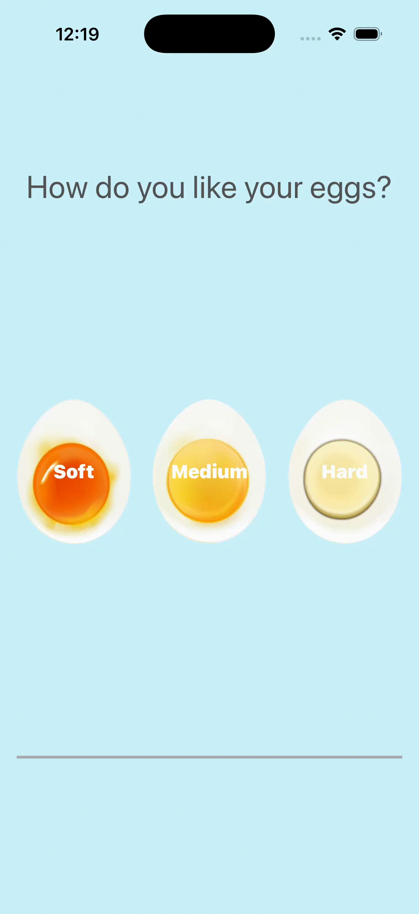

# 🥚 EggTimer

An iOS timer application built with Swift and UIKit.

This app allows users to select the hardness of a boiled egg and automatically starts a countdown timer. A progress bar visualizes the remaining cooking time, and an alarm sound is played when the timer finishes.

---

## Demo

  

---

## Features

- 🥚 Select egg hardness (Soft / Medium / Hard)
- ⏱ Countdown timer
- 📊 Progress bar
- 🔔 Alarm sound when cooking is complete
- 📱 Simple and intuitive UI

---

## Tech Stack

- Swift
- UIKit
- Xcode
- AVFoundation
- Timer

---

## What I Learned

While developing this project, I learned:

- How to use `Timer`
- UI updates using `IBOutlet`
- Handling button actions with `IBAction`
- Playing sounds using `AVFoundation`
- Managing app state during countdown

---

## Author

Tomoyo